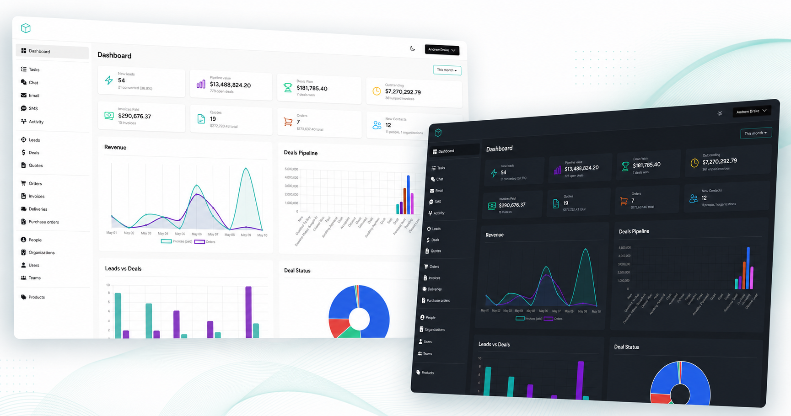
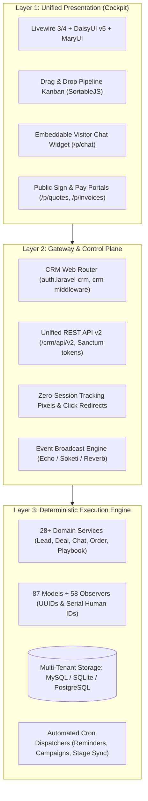

# Laravel CRM

<p align="center">
  
</p>

<p align="center">
  <a href="https://github.com/MuzikayiseKhuzwayo/crm/blob/master/LICENSE.md"></a>
  <a href="https://packagist.org/packages/venturedrake/laravel-crm"></a>
  <a href="https://packagist.org/packages/venturedrake/laravel-crm"></a>
  
  
  
</p>

---

## ⚡ The Modern Open-Source CRM for Laravel

**Laravel CRM** (`venturedrake/laravel-crm`) transforms any Laravel application into an enterprise-grade Customer Relationship Management platform. Designed as an unopinionated, embeddable package, it provides complete pipeline lifecycle management, omni-channel customer chat, outbound marketing automation, and automated sales motions—with zero external microservice dependencies.

- 🖥️ **Unified Presentation Cockpit:** Reactive Livewire 3/4 components styled with Tailwind CSS v4, DaisyUI v5, and MaryUI.
- 🎯 **Full Sales Pipeline:** Leads, Kanban Boards, Deals, Quotes with digital signing, Orders, Invoices, Deliveries, and Purchase Orders.
- 💬 **Omni-Channel Customer Chat:** Embeddable cross-domain visitor widget with live WebSocket operator broadcasting.
- 📣 **Email & SMS Marketing:** Automated campaign dispatchers, rich template builders, ClickSend SMS, and open/click telemetry.
- 🔌 **Unified REST API (v2):** Token-authenticated endpoints for headless mobile and partner integrations.
- 🛡️ **Zero-Drift Enterprise Security:** Multi-tenant team isolation (`LARAVEL_CRM_TEAMS`), 41 Spatie policies, and at-rest AES-256 field encryption.

👉 **[View Interactive Product Showcase](https://github.com/MuzikayiseKhuzwayo/crm/blob/master/public/showcase.html)**

---

## 🏛️ System Architecture

Laravel CRM is engineered across a strict 3-tier boundary:



---

## 🚀 10-Minute Quickstart

Install the package into your Laravel 11, 12, or 13 app:

```bash
composer require venturedrake/laravel-crm
```

Run the automated one-shot installer:

```bash
php artisan laravelcrm:install
```

Grant CRM access to an administrative user:

```bash
php artisan laravelcrm:add-user admin@example.com --name="System Administrator" --role="Owner"
```

Start your server and visit `/crm`:

```bash
php artisan serve
```

---

## 📚 Boundary-First Documentation (Diátaxis)

Our documentation is strictly organized according to the **Diátaxis** framework to serve every developer persona:

<div align="center">

| Quadrant | Purpose | Key Guides |
|---|---|---|
| **🎓 [Tutorials](https://github.com/MuzikayiseKhuzwayo/crm/blob/master/docs/tutorials/quickstart.md)** | Learning-oriented zero-to-one walkthroughs | • [10-Minute Zero-to-One Quickstart](https://github.com/MuzikayiseKhuzwayo/crm/blob/master/docs/tutorials/quickstart.md) |
| **🛠️ [How-To Guides](https://github.com/MuzikayiseKhuzwayo/crm/tree/master/docs/how-to)** | Problem-oriented recipes for common tasks | • [Importing Leads & Datasets](https://github.com/MuzikayiseKhuzwayo/crm/blob/master/docs/how-to/importing-leads.md)<br>• [Setting Up Real-Time Chat](https://github.com/MuzikayiseKhuzwayo/crm/blob/master/docs/how-to/setting-up-chat.md)<br>• [Email & SMS Marketing](https://github.com/MuzikayiseKhuzwayo/crm/blob/master/docs/how-to/email-and-sms-marketing.md)<br>• [Version Upgrading Guide](https://github.com/MuzikayiseKhuzwayo/crm/blob/master/docs/how-to/upgrading.md) |
| **📖 [Reference](https://github.com/MuzikayiseKhuzwayo/crm/tree/master/docs/reference)** | Machine-accurate specifications and tables | • [REST API (v2) Specification](https://github.com/MuzikayiseKhuzwayo/crm/blob/master/docs/reference/api-v2.md)<br>• [Artisan CLI Command Table](https://github.com/MuzikayiseKhuzwayo/crm/blob/master/docs/reference/cli-commands.md)<br>• [Configuration & .env Keys](https://github.com/MuzikayiseKhuzwayo/crm/blob/master/docs/reference/configuration.md) |
| **💡 [Explanation](https://github.com/MuzikayiseKhuzwayo/crm/tree/master/docs/explanation)** | Architectural narratives and system reasoning | • [Architecture & Design Philosophy](https://github.com/MuzikayiseKhuzwayo/crm/blob/master/docs/explanation/architecture-philosophy.md)<br>• [Security, Roles & Field Encryption](https://github.com/MuzikayiseKhuzwayo/crm/blob/master/docs/explanation/security-and-encryption.md)<br>• [Production Scaling & High-Throughput](https://github.com/MuzikayiseKhuzwayo/crm/blob/master/docs/explanation/scaling-and-deployment.md) |

</div>

---

## ⚡ Unified REST API (v2)

Headless applications and external integrations interact with the unified API under `/crm/api/v2`:

```bash
# Issue an API token
curl -X POST https://your-domain.com/crm/api/v2/auth/token \
  -H "Content-Type: application/json" \
  -d '{"email":"admin@example.com","password":"secret","device_name":"Mobile"}'

# Fetch leads with sorting and relationships
curl -X GET "https://your-domain.com/crm/api/v2/leads?sort=-amount" \
  -H "Authorization: Bearer <token>" \
  -H "Accept: application/json"
```

---

## 🧪 Testing & Code Standards

Laravel CRM maintains a rigorous testbench test suite:

```bash
# Run test suite (Pest)
composer test

# Check code formatting (Laravel Pint)
composer format-test

# Compile frontend assets
npm run build
```

---

## 📄 License

Laravel CRM is open-sourced software licensed under the [MIT license](https://github.com/MuzikayiseKhuzwayo/crm/blob/master/LICENSE.md).